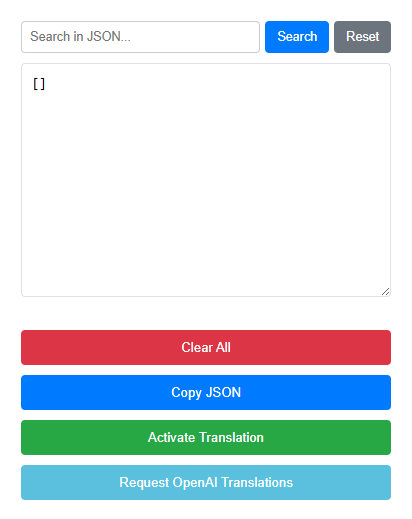

# WordPress Universal Translator


## The Problem → Solution → Impact

<div align="center">

| 🚫 **The Problem** | 💡 **The Solution** | 📈 **The Impact** |
|:-------------------|:---------------------|:-------------------|
| **Website theme compatibility issues**<br/>WPML not loading all page strings<br/>Double the translation work required | **Universal Chrome extension**<br/>Works on any WordPress site<br/>Direct page translation capability | **🌍 Universal compatibility**<br/>**⚡ Complete page translations**<br/>**🎯 No theme limitations** |
| **Manual translation workflows**<br/>Time-intensive SEO optimization<br/>Inconsistent keyword integration | **Bulk URL processing**<br/>AI-powered SEO translations<br/>Automated keyword optimization | **📈 SEO-friendly results**<br/>**🚀 Bulk processing**<br/>**✅ Optimal client outcomes** |
| **Plugin limitations**<br/>Theme-specific translation failures<br/>Incomplete page coverage | **Browser-level automation**<br/>Direct DOM manipulation<br/>Bypasses all plugin restrictions | **🔓 No plugin dependencies**<br/>**📊 100% page coverage**<br/>**⚡ Reliable performance** |

</div>

---

## Why I Built This

I developed this extension after creating the WPML Translation Helper. The website theme kept causing problems - even with WPML, it wouldn't load page strings properly, preventing complete page translations and doubling the workload.

I had to modify my first version to work universally, anywhere. The result? This extension can be used on any WordPress site. The beautiful thing is that, like its previous version, you can upload all updated URLs and proceed with converting all links and translating all pages with an SEO-friendly approach, ensuring optimal results for clients.

**The goal was simple:** Build something that eliminates theme-specific translation problems while maintaining SEO quality across all WordPress implementations.

---

## Screenshots

<div>

### Translation Interface


*Clean interface for managing WordPress translations with SEO optimization*

</div>

---

## Table of Contents

- [Quick Start](#quick-start)
- [Key Features](#key-features)
- [Installation Guide](#installation-guide)
- [Configuration](#configuration)
- [Usage Examples](#usage-examples)
- [SEO Integration](#seo-integration)
- [Technical Details](#technical-details)
- [Future Enhancements](#future-enhancements)

---

## Quick Start

1. **Install the extension** in Chrome developer mode
2. **Get OpenAI API key** for AI-powered translations
3. **Configure target keywords** for SEO optimization
4. **Visit any WordPress site** and start translating

**Ready to translate in under 5 minutes.**

---

## Key Features

### **Universal Compatibility**
- **Works on any WordPress site** regardless of theme or plugins
- **Direct browser automation** bypasses plugin limitations
- **Theme-agnostic approach** handles custom implementations
- **No WordPress admin dependencies** for translation workflow

### **AI-Powered Translation**
- **OpenAI integration** for high-quality translations
- **SEO keyword optimization** with target market focus
- **Custom prompt management** for consistent quality
- **Context-aware translations** understanding page structure

### **Bulk Processing**
- **URL batch processing** for multiple pages
- **Bulk checkbox selection** for content and media
- **Progress tracking** for large translation projects
- **Automated link conversion** across translated pages

---

## Installation Guide

### Step 1: Download the Extension
```bash
git clone https://github.com/Yassir00000/wordpress-universal-translator.git
cd wordpress-universal-translator/WUT-chrome-extention
```

### Step 2: Load in Chrome
1. Open `chrome://extensions/`
2. Enable **"Developer mode"** (top right toggle)
3. Click **"Load unpacked"**
4. Select the `WUT-chrome-extention` folder
5. Pin the extension to your toolbar

### Step 3: Configure API & Keywords
1. Get **OpenAI API key** from [OpenAI Platform](https://platform.openai.com/)
2. Click the extension icon
3. Enter your API key in settings
4. Configure **target keywords** in `Keywords.txt`
5. Customize **translation prompts** if needed

**Installation complete!**

---

## Configuration

### SEO Keywords Setup
Edit `Keywords.txt` with target market keywords:
```
WordPress development
Web design services
Digital marketing
E-commerce solutions
```

### Translation Prompts
Customize `prompt.txt` for specific translation needs:
- Industry-specific terminology
- Brand voice consistency
- Regional language preferences
- SEO optimization instructions

### URL Management
- **Bulk URL processing** - Upload multiple pages for translation
- **Link conversion** - Automatic internal link updates
- **Media handling** - Image and media content translation support

---

## Usage Examples

### Example 1: Single Page Translation
1. Navigate to any WordPress page
2. Click the extension icon
3. Select content elements to translate
4. Apply AI-powered translation with SEO keywords
5. Review and publish translated content

### Example 2: Bulk Site Translation
1. Prepare URL list for batch processing
2. Load URLs into the extension
3. Configure translation settings and keywords
4. Run bulk translation process
5. Export translated content for implementation

### Example 3: E-commerce Site
1. Navigate to product pages
2. Extract product descriptions and details
3. Apply market-specific keyword optimization
4. Translate with regional language preferences
5. Update all internal product links automatically

---

## SEO Integration

### Keyword Optimization
- **Automatic keyword integration** during translation
- **Target market focus** for regional SEO performance
- **Keyword density optimization** for search rankings
- **Meta tag translation** with SEO best practices

### URL Structure
- **SEO-friendly URL handling** for translated pages
- **Canonical link management** across language versions
- **Internal link conversion** maintaining SEO value
- **Sitemap compatibility** for multilingual sites

### Content Quality
- **AI-powered content optimization** for target markets
- **Cultural adaptation** beyond literal translation
- **Search intent alignment** with regional preferences
- **Quality assurance** for translated content accuracy

---

## Technical Details

### Architecture
- **Chrome Extension (Manifest V3)** - Modern extension platform
- **Content Script Injection** - Direct page DOM manipulation
- **OpenAI API Integration** - AI-powered translation engine
- **Local Storage Management** - Settings and progress persistence

### Key Components
```
WUT-chrome-extention/
├── manifest.json          # Extension configuration
├── background.js           # Service worker logic
├── content.js             # Page manipulation script
├── popup.html/js          # User interface
├── style.css              # Extension styling
├── Keywords.txt           # SEO keyword configuration
└── prompt.txt             # Translation prompt template
```

### Processing Flow
1. **Page Analysis** - DOM structure scanning
2. **Content Extraction** - Text and media identification
3. **AI Translation** - OpenAI API processing with SEO optimization
4. **Content Replacement** - Direct DOM updates
5. **Link Management** - Automatic URL conversion

---

## Future Enhancements

### **Translation Providers**
- **Google Translate API** - Alternative to OpenAI for cost optimization
- **DeepL integration** - Higher quality translations for European languages

### **SEO Automation**
- **Automatic keyword research** - Dynamic keyword discovery for target markets
- **SEO performance tracking** - Monitor search ranking improvements

### **Workflow Optimization**
- **Translation memory** - Reuse previous translations for consistency
- **Batch processing** - Queue multiple pages for automated translation

### **Multi-site Support**
- **WordPress network compatibility** - Handle multiple sites from single interface
- **Project management** - Organize translations by client/campaign

---

## License

MIT License - see [LICENSE](LICENSE) file for details.

**Note:** This extension is independent software and not affiliated with WordPress.org. Users must comply with OpenAI's usage policies and website terms of service.

---

<div align="center">

**Built by [Yassir00000](https://github.com/Yassir00000)**

*Practical automation tools for real business problems*

</div>